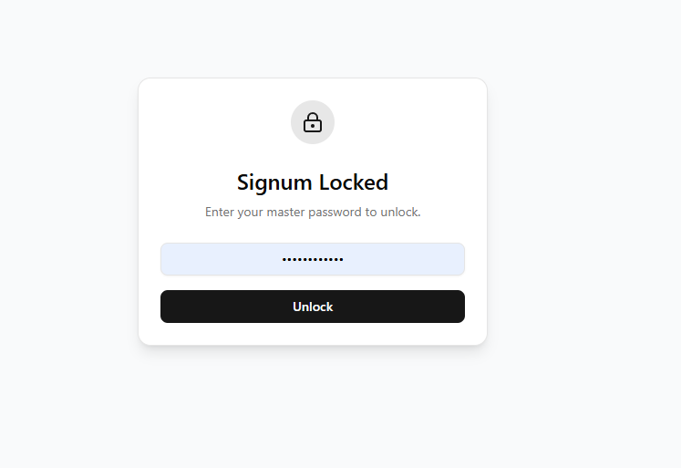

# Signum Credential Manager


Signum is a simple, secure, locally hosted credential manager designed to "seal" and protect your sensitive information. It is built with a "Zero Knowledge" architecture in mind.

## Features




- **The Seal:** Secure Lock Screen requiring a Master Password.
- **Vault:** AES-256-GCM encrypted JSON storage (`signum-vault.json`).
- **Dashboard:** Create, View, Copy, and Search credentials.
- **Security:** Industry-standard cryptography using **Argon2id** (Key Derivation) and **AES-256-GCM** (Encryption).
- **Local First:** All data stays on your machine.

## Tech Stack

- **Framework:** Next.js 14 (App Router)
- **Styling:** Tailwind CSS + shadcn/ui
- **Cryptography:** `argon2` + `node:crypto`
- **Language:** TypeScript

## Getting Started

1.  **Clone the repository:**
    ```bash
    git clone https://github.com/your-username/signum.git
    cd signum
    ```

2.  **Install dependencies:**
    ```bash
    npm install
    ```

3.  **Run the application:**
    ```bash
    npm run dev
    ```

4.  **Open in Browser:**
    Navigate to `http://localhost:3000`.

5.  **Setup:**
    - On first launch, you will be asked to create a Master Password.
    - **WARNING:** This password is NOT stored anywhere. If you lose it, you lose access to your vault.

    - **WARNING:** This password is NOT stored anywhere. If you lose it, you lose access to your vault.

## Run on Startup (Windows)

To have Signum start automatically when you log in:

1.  **Build the app** (if you haven't already):
    ```bash
    npm run build
    ```
2.  **Open the Startup folder:**
    - Press `Win + R` on your keyboard.
    - Type `shell:startup` and press Enter.
3.  **Create a Shortcut:**
    - Right-click the `start-signum.bat` file in your project folder.
    - Select **Create shortcut**.
    - Move this new shortcut into the **Startup** folder you opened in step 2.

Now Signum will launch automatically whenever you start your computer!

## Building for Production

To create an optimized production build:

```bash
npm run build
npm start
```
